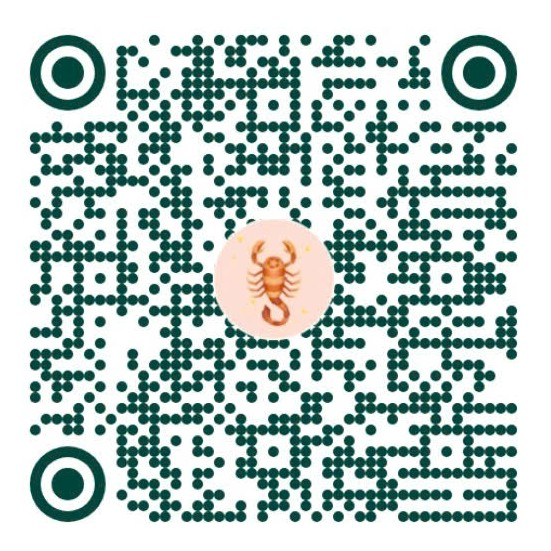

# Hỗ trợ & Mời cà phê tác giả (SUPPORT)

Cảm ơn bạn đã quan tâm và sử dụng công cụ **VNCare Phiên Địa Chỉ 2 Cấp**.

## Kênh hỗ trợ & Phản hồi

Nếu bạn gặp khó khăn trong quá trình sử dụng, phát hiện lỗi hoặc muốn đóng góp ý tưởng cải tiến:

- **Tạo Issue trên GitHub:** [https://github.com/Nsnnam/vncare-diachi-web/issues](https://github.com/Nsnnam/vncare-diachi-web/issues)
- **Tác giả:** Nguyễn Sơn Nam (Nsnnam / NamNS)
- **Email:** akahimachi@gmail.com
- **Trang cá nhân:** [https://github.com/Nsnnam](https://github.com/Nsnnam)

---

## Mời cà phê tác giả ☕

Nếu công cụ giúp bạn tiết kiệm thời gian, giải quyết nhanh công việc nhập liệu danh sách khám sức khỏe và xử lý hồ sơ ngoại trú, hãy ủng hộ tác giả một tách cà phê nhé!

| Thông tin chuyển khoản | Chi tiết |
|---|---|
| **Chủ tài khoản** | **NGUYEN SON NAM** |
| **Số tài khoản** | **8855989777** |
| **Ngân hàng** | **BIDV — Ngân hàng TMCP Đầu tư và Phát triển Việt Nam** |
| **Chi nhánh / PGD** | PGD Nguyễn Tất Thành |
| **Nội dung** | `VNCare DiaChi - Ung ho` |

